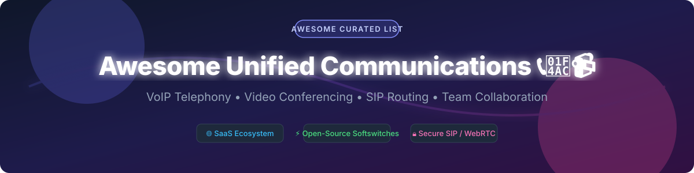

# 📞 Awesome Unified Communications 💬📹

  
  
  
  
  

  

## 🚀 Top Unified Communications (UC) & Cloud PBX Ecosystem

> A curated list of enterprise **SaaS platforms**, **Open-Source softswitches**, **SIP proxies**, **VoIP telephony solutions**, and **WebRTC video conferencing engines**. 

Unified Communications (UC) integrates real-time enterprise communication services—such as IP telephony (VoIP), instant messaging (chat), presence information, audio/video conferencing, data sharing, call routing, and contact center capabilities (CCaaS)—into a cohesive multi-device software suite.

---

## 📑 Table of Contents

- [📊 Sector Overview & Market Size](#-sector-overview--market-size)
- [🌐 SaaS & Hosted UCaaS Platforms](#-saas--hosted-ucaas-platforms)
- [⚡ Open-Source GitHub Projects](#-open-source-github-projects)
- [💡 How to Contribute](#-how-to-contribute)
- [⚠️ Enterprise Deployment & Security Disclaimer](#%EF%B8%8F-enterprise-deployment--security-disclaimer)
- [💖 Support & Sponsorship](#-support--sponsorship)
- [📈 Star History](#-star-history)

---

## 📊 Sector Overview & Market Size

The global **Unified Communications as a Service (UCaaS)** market size was valued at approximately **$85 Billion in 2025** and is projected to reach over **$170 Billion by 2032**, growing at a CAGR of 10.5%.

> **Market Concentration & Structure**: The UC sector is **moderately fragmented to tier-concentrated**. While large tech conglomerates (Microsoft, Cisco) command massive market share in general business messaging and video conferencing (creating a "winner-take-most" dynamic in the enterprise productivity tier), specialized enterprise VoIP, SIP routing, CCaaS, and developer APIs remain vibrant with pure-play UC leaders (RingCentral, Zoom Phone, Dialpad) and carrier-grade open-source engines powering core infrastructure behind the scenes.

---

## 🌐 SaaS & Hosted UCaaS Platforms

Below is a curated table of leading enterprise UCaaS and cloud phone system providers, sorted by company size (Annual Revenue / Market Valuation) in descending order:

| 🏢 Product | 📝 Description | 💰 Company Size (Revenue / Valuation) | 💳 Pricing (Starting Tier) | 🎁 Free Tier / Trial Limit |
| :--- | :--- | :--- | :--- | :--- |
| **[Microsoft Teams](https://www.microsoft.com/microsoft-teams/)** | Enterprise UC platform integrating chat, video meetings, calling, and collaboration with Office 365. Teams Phone provides PSTN calling with Microsoft Calling Plans or Direct Routing. | **~$245 Billion/yr** (Microsoft Corp) | $4.00/user/month (Teams Essentials) | Free Plan: 60 min meeting limit, 100 participants max, 5 GB storage |
| **[Cisco Webex](https://www.webex.com/)** | Enterprise UC suite with meetings, calling, messaging, and contact center. Webex Calling provides cloud PBX with global PSTN coverage. | **~$54 Billion/yr** (Cisco Systems) | $14.50/user/month (Webex Starter) | Free Plan: 40 min meeting limit per group call, 100 participants max |
| **[Zoom Phone](https://www.zoom.com/en/products/phone/)** | Cloud phone system integrated with Zoom Meetings. Offers domestic and international calling plans with SMS, voicemail, and call routing. | **~$4.5 Billion/yr** (~$20B Market Cap) | $10.00/user/month (Metered Plan) | No free tier or trial for Zoom Phone (Zoom Meetings basic has 40 min limit) |
| **[RingCentral MVP](https://www.ringcentral.com/)** | Cloud UC platform with messaging, video, and phone (now RingEX). Includes team messaging, video meetings, and enterprise-grade telephony. | **~$2.2 Billion/yr** (~$3B Market Cap) | $20.00/user/month (Core plan, annual) | 14-day free trial (up to 5–20 lines/users, hardware demo up to 2 desk phones) |
| **[GoTo Connect](https://www.goto.com/connect)** | UC platform combining GoTo Meeting, GoTo Phone, and messaging in a single interface (GoTo Group). | **~$1.3 Billion/yr** (GoTo Group) | $26.00/user/month (Basic plan starting rate) | Demo by request / 14-day free trial for GoTo Meeting only |
| **[Vonage Business](https://www.vonage.com/)** | Cloud communications platform with UCaaS, CCaaS, and programmable APIs (Acquired by Ericsson for $6.2B). | **~$1.4 Billion/yr** ($6.2B Valuation) | $13.99/user/month (Mobile plan, annual) | No free tier or free trial available |
| **[8x8 X Series](https://www.8x8.com/)** | Integrated cloud UC and contact center platform with voice, video, chat, and analytics. | **~$750 Million/yr** (~$400M Market Cap) | $24.00/user/month (X2 plan base tier) | 30-day free trial (available for 8x8 Express; no free trial for main X Series) |
| **[Dialpad](https://www.dialpad.com/)** | AI-powered UC platform with voice, video, messaging, and contact center. Strong AI features including real-time transcription. | **~$200 Million ARR** ($2.2B Valuation) | $15.00/user/month (Standard plan, annual) | 14-day free trial (full feature access, no credit card required) |
| **[Mitel MiCloud](https://www.mitel.com/)** | Legacy cloud UC platform with enterprise telephony, collaboration, and contact center capabilities. | **~$500 Million/yr** (Private Equity Owned) | Discontinued / Custom Quote (Historically ~$20.99/user/month) | No free tier or free trial available (Platform sunset in June 2026) |

---

## ⚡ Open-Source GitHub Projects

Unified communications relies heavily on battle-tested open-source infrastructure for media processing, SIP routing, softswitches, and WebRTC streaming. Below are top open-source projects, **sorted by GitHub Stars_Count (descending)**:

| 📦 Project & Repo | ⭐ Stars_Count | 📜 License | ℹ️ Description & Key Capabilities |
| :--- | :--- | :--- | :--- |
| **[Rocket.Chat](https://github.com/RocketChat/Rocket.Chat)** |  | MIT | **Ultimate open-source team communication platform**. Features channels, direct messaging, file sharing, video conferencing via Jitsi integration, and omnichannel support. The leading self-hosted Slack alternative with an extensive app marketplace. |
| **[Mattermost](https://github.com/mattermost/mattermost)** |  | MIT / Commercial | **Enterprise-grade secure collaboration platform**. Built for developer and security-conscious teams with channels, messaging, file sharing, and integrated audio/video calling. High compliance (HIPAA/FINRA). |
| **[Jitsi Meet](https://github.com/jitsi/jitsi-meet)** |  | Apache-2.0 | **De facto open-source video conferencing engine**. Fully WebRTC-based multi-party video calling platform. Includes screen sharing, meeting recording (Jibri), SIP gateway integration (Jigasi), and zero-install browser sessions. |
| **[LiveKit](https://github.com/livekit/livekit)** |  | Apache-2.0 | **Modern high-performance WebRTC developer stack**. Designed for real-time multi-user voice, video, and data streaming. Features a Go-based SFU server, client SDKs for Web, iOS, Android, and unity, plus AI voice agent integrations. |
| **[Matrix Synapse](https://github.com/element-hq/synapse)** |  | AGPL-3.0 | **Reference homeserver implementation for the Matrix protocol**. Powers decentralized, end-to-end encrypted messaging, federated group chat, voice/video signaling, and interoperable bridges to legacy networks. |
| **[Element Web](https://github.com/element-hq/element-web)** |  | Apache-2.0 | **Flagship Matrix protocol web client**. Enterprise secure messaging client with end-to-end encryption (E2EE), WebRTC VoIP calling, file sharing, and multi-account federation support. |
| **[BigBlueButton](https://github.com/bigbluebutton/bigbluebutton)** |  | LGPL-3.0 | **Open-source virtual classroom & web conferencing system**. Designed for online learning with real-time whiteboard sharing, slide presentations, public/private chat, breakout rooms, and session recording. |
| **[FreeSWITCH](https://github.com/signalwire/freeswitch)** |  | MPL-1.1 | **Leading open-source softswitch & telephony engine**. Highly modular multi-threaded telephony platform designed for high-density carrier softswitches, WebRTC media gateways, and commercial UC engines (maintained by SignalWire). |
| **[Asterisk](https://github.com/asterisk/asterisk)** |  | GPL-2.0 | **World's most deployed open-source PBX platform**. Powers millions of IP phone systems, call centers, IVR interactive voice menus, and conference bridges worldwide. Supports SIP, IAX2, and PSTN hardware cards. |
| **[Kamailio](https://github.com/kamailio/kamailio)** |  | GPL-2.0 | **Carrier-grade open-source SIP proxy & router**. Handles tens of thousands of call setups per second. Serves as the core SIP Session Border Controller (SBC), load balancer, registrar, and WebRTC gateway for major telecom operators. |
| **[OpenSIPS](https://github.com/OpenSIPS/opensips)** |  | GPL-2.0 | **High-performance open-source SIP server**. Multi-functional implementation focusing on fast SIP routing, load balancing, NAT traversal engine, and custom VoIP service development. |
| **[FreePBX Framework](https://github.com/FreePBX/framework)** |  | GPL-2.0 | **De facto web-based GUI management interface for Asterisk**. Simplifies PBX setup with visual call routing, extension management, voicemail configuration, IVR builders, and trunking controls. |
| **[FusionPBX](https://github.com/fusionpbx/fusionpbx)** |  | MPL-1.1 | **Web-based multi-tenant management GUI for FreeSWITCH**. Powerful web administrative interface for creating scalable cloud PBX platforms, call center queues, and multi-domain hosted VoIP solutions. |
| **[Nextcloud Talk (Spreed)](https://github.com/nextcloud/spreed)** |  | AGPL-3.0 | **Self-hosted audio/video conferencing and chat for Nextcloud**. Integrates with enterprise file storage, calendar, and contacts. Supports Janus SFU for large video meetings and SIP bridge connectivity. |
| **[Linphone Desktop](https://github.com/BelledonneCommunications/linphone-desktop)** |  | GPL-3.0 | **Open-source cross-platform SIP softphone**. Enterprise-grade VoIP client supporting HD voice/video, TLS/SRTP encryption, LDAP directory synchronization, and modern audio codecs (opus). |
| **[Wazo Platform](https://github.com/wazo-platform/wazo-platform)** |  | GPL-3.0 | **Programmable CaaS & UC platform built on Asterisk**. API-first architecture designed for developers building custom IP telephony applications, multi-tenant PBX systems, and contact centers. |

---

## 🛠 Architectural Stack & Framework Recommendation

When building enterprise communications infrastructure:
- 📞 **Traditional Enterprise PBX**: Combine **Asterisk + FreePBX** for turn-key IP PBX deployments with rich hardware compatibility and standard SIP phone auto-provisioning.
- ☁️ **Multi-Tenant Hosted VoIP**: Deploy **FreeSWITCH + FusionPBX** for scalable cloud PBX platforms with multi-domain tenant isolation.
- 🌐 **Carrier-Grade SIP Routing / SBC**: Utilize **Kamailio** or **OpenSIPS** as frontline SIP proxies to handle NAT traversal, SIP trunk authentication, DDoS protection, and high-volume session load balancing.
- 🎥 **WebRTC Video Conferencing**: Deploy **Jitsi Meet** or **LiveKit** for low-latency, multi-party video conferencing, screen sharing, and WebRTC SFU streaming.
- 💬 **Team Messaging & E2EE Chat**: Choose **Rocket.Chat** or **Mattermost** for standalone enterprise chat suites, or **Element (Matrix)** for decentralized federated communications.

---

## 💡 How to Contribute

Contributions are welcome! Please follow these simple guidelines:

1. Fork this repository on GitHub.
2. Edit `README.md` to add or update relevant entries.
3. Ensure all links point directly to official documentation or canonical GitHub repos.
4. Submit a Pull Request with a short summary of changes.

See the curated master directory at [Awesome-Awesome-Awesome](https://github.com/ishandutta2007/Awesome-Awesome-Awesome) for more curated tech stacks!

---

## ⚠️ Enterprise Deployment & Security Disclaimer

- This list is **community-curated** for educational, architectural, and evaluation purposes.
- **Security & Compliance**: Self-hosting voice and video communications requires robust network security, TLS signaling encryption, SRTP media encryption, NAT traversal (STUN/TURN), and regulatory compliance (E911 Emergency Services, GDPR, HIPAA, STIR/SHAKEN caller ID authentication).
- **PSTN Trunking**: Open-source PBX servers require external SIP trunk providers for public telephone network connectivity and DID phone number allocation.

---

## 💖 Support & Sponsorship

If you find this curated Unified Communications ecosystem list useful for your research, team, or production architecture, please consider:
- 🌟 **Starring** this repository to increase visibility!
- 🔀 **Forking** it to keep your own reference copy.
- 📢 **Sharing** it with telecommunication engineers, UC architects, and DevOps teams.

☕ **Buy Me a Coffee**: If you would like to support ongoing open-source curation work, feel free to sponsor via [GitHub Sponsors](https://github.com/sponsors/ishandutta2007).

---

## 📈 Star History

---

  <b>Made with ❤️ for IT Administrators, Telecommunications Engineers, and UC Architects worldwide.</b>

